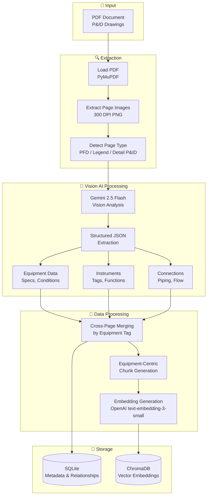

# P&ID Assistant - RAG System Flow Diagram

## Executive Summary

The P&ID Assistant is an AI-powered system that enables natural language querying of Piping and Instrumentation Diagrams (P&IDs) for Oil & Gas operations. It combines **Retrieval-Augmented Generation (RAG)** for text-based queries with **Vision AI** for visual/spatial queries, providing engineers with instant access to equipment specifications, instrument details, and process flow information.

The system uses a hybrid architecture with two main pipelines: an **Ingestion Pipeline** that processes PDF documents into searchable embeddings, and a **Query Pipeline** that routes user questions to the appropriate AI engine. Document content is stored in a dual-database architecture—ChromaDB for semantic vector search and SQLite for structured metadata and equipment relationships.

Key differentiators include **vision-based extraction** using Gemini to understand P&ID diagrams (preserving spatial equipment-instrument relationships that text extraction loses), **equipment-centric chunking** that groups related instruments with their parent equipment, and **multi-provider LLM support** allowing seamless switching between Gemini, OpenAI, and Claude based on cost/performance requirements.

---

## High-Level Architecture

```
┌─────────────────────────────────────────────────────────────────────────────┐
│                        P&ID DIGITAL ASSISTANT                                │
├─────────────────────────────────────────────────────────────────────────────┤
│                                                                              │
│   ┌──────────────┐         INGESTION PIPELINE                               │
│   │              │                                                          │
│   │  PDF Files   │ ──► Image Extraction ──► Vision AI ──► Chunk Generation │
│   │  (P&IDs)     │            │                 │               │           │
│   │              │            │                 │               │           │
│   └──────────────┘            ▼                 ▼               ▼           │
│                         ┌─────────────────────────────────────────┐         │
│                         │           STORAGE LAYER                 │         │
│                         │  ┌─────────────┐  ┌─────────────────┐  │         │
│                         │  │   SQLite    │  │    ChromaDB     │  │         │
│                         │  │  (Metadata) │  │   (Embeddings)  │  │         │
│                         │  └─────────────┘  └─────────────────┘  │         │
│                         └─────────────────────────────────────────┘         │
│                                        ▲                                     │
│                                        │                                     │
│                              QUERY PIPELINE                                  │
│                                        │                                     │
│   ┌──────────────┐      ┌─────────────┴─────────────┐      ┌────────────┐  │
│   │              │      │                           │      │            │  │
│   │  User Query  │ ──►  │     Query Router          │ ──►  │    LLM     │  │
│   │              │      │   (RAG vs Vision)         │      │  Response  │  │
│   │              │      │                           │      │            │  │
│   └──────────────┘      └───────────────────────────┘      └────────────┘  │
│                                                                              │
└─────────────────────────────────────────────────────────────────────────────┘
```

---

## Ingestion Pipeline

The ingestion pipeline transforms P&ID PDF documents into searchable, semantically-indexed content.



### Ingestion Steps Explained

| Step | Process | Details |
|------|---------|---------|
| **1. PDF Loading** | PyMuPDF opens PDF | Extracts page count, metadata |
| **2. Image Extraction** | Render pages to PNG | 300 DPI for OCR quality |
| **3. Page Type Detection** | Classify each page | PFD (overview), Legend, Detail P&ID |
| **4. Vision Extraction** | Gemini analyzes images | Type-specific prompts for each page type |
| **5. JSON Parsing** | Validate extracted data | Pydantic models ensure type safety |
| **6. Cross-Page Merging** | Merge by equipment tag | P&ID details override PFD basics |
| **7. Chunk Generation** | Equipment-centric chunks | Each chunk = 1 equipment + its instruments |
| **8. Embedding** | Generate vectors | 1536-dimension embeddings |
| **9. Storage** | Dual persistence | SQLite (relations) + ChromaDB (vectors) |

### Equipment-Centric Chunk Example

```
V-101 - HIGH PRESSURE SEPARATOR
Type: Vessel (Horizontal)

SPECIFICATIONS:
- Size: 60" I.D. x 18'-6" S/S
- Design Pressure: 1200 PSIG at 300°F
- Operating: 350 PSIG at 70°F

INSTRUMENTS:
- PSV-101: Pressure Safety Valve (overpressure protection)
- PT-101A/B/C/D: Pressure Transmitters
- LT-101A/B: Level Transmitters
- LIC-101A: Level Controller
- SDV-101: Shutdown Valve (inlet isolation)

CONNECTIONS:
- Inlet: 6"-D from Production Header
- Gas Outlet: 8"-D to C-104 Gas Compressor
- Liquid Outlet: 4"-D to V-102 LP Separator
```

---

## Query Pipeline

The query pipeline routes user questions to the appropriate AI engine and returns contextual answers.

```mermaid
flowchart TD
    subgraph INPUT["👤 User Input"]
        QUERY[User Query<br/>"What is V-101?"]
    end

    subgraph PREPROCESS["⚙️ Preprocessing"]
        ENTITY[Entity Extraction<br/>Regex: V-101, PSV-101]
        TICKET[Ticket Lookup<br/>Maintenance Records]
        ROUTER{Query Router<br/>Keyword Detection}
    end

    subgraph RAG["📚 RAG Path"]
        QEMBED[Generate Query<br/>Embedding]
        SEARCH[Vector Search<br/>ChromaDB HNSW]
        CONTEXT[Context Assembly<br/>Top-K Chunks]
        PROMPT[Build Prompt<br/>Template + Context]
        LLMRAG[LLM Call<br/>Generate Answer]
    end

    subgraph VISION["🖼️ Vision Path"]
        PAGESEL[Select Relevant<br/>Pages]
        IMGLOAD[Load Images<br/>Base64 Encode]
        LLMVIS[Vision LLM<br/>Analyze + Answer]
    end

    subgraph OUTPUT["📤 Response"]
        RESPONSE[Answer +<br/>Metadata + Sources]
    end

    QUERY --> ENTITY --> TICKET --> ROUTER
    ROUTER -->|"Text Query<br/>(no visual keywords)"| QEMBED
    ROUTER -->|"Visual Query<br/>(show, where, flow)"| PAGESEL

    QEMBED --> SEARCH --> CONTEXT --> PROMPT --> LLMRAG --> RESPONSE
    PAGESEL --> IMGLOAD --> LLMVIS --> RESPONSE
```

### Query Routing Logic

The router uses keyword detection to determine the query path:

| Keywords Detected | Route | Example Query |
|-------------------|-------|---------------|
| *None* | RAG | "What is V-101?" |
| show, display, see | Vision | "Show me V-101 on the diagram" |
| where, locate, location | Vision | "Where is the compressor?" |
| flow, path, route | Vision | "What's the flow path to C-104?" |
| connected, upstream, downstream | Vision | "What's connected to V-101?" |

### RAG Path Details

```
User Query: "What are the operating conditions for V-101?"
                    │
                    ▼
    ┌───────────────────────────────┐
    │ 1. Generate Query Embedding   │
    │    OpenAI text-embedding-3-small
    │    → 1536-dimension vector    │
    └───────────────────────────────┘
                    │
                    ▼
    ┌───────────────────────────────┐
    │ 2. Vector Search (ChromaDB)   │
    │    Algorithm: HNSW (ANN)      │
    │    Metric: Cosine Similarity  │
    │    Results: Top-K=3 chunks    │
    └───────────────────────────────┘
                    │
                    ▼
    ┌───────────────────────────────┐
    │ 3. Context Assembly           │
    │    Format chunks with:        │
    │    - Source page number       │
    │    - Relevance score          │
    │    - Chunk text content       │
    └───────────────────────────────┘
                    │
                    ▼
    ┌───────────────────────────────┐
    │ 4. Prompt Construction        │
    │    Template:                  │
    │    "You are a technical       │
    │     assistant... Context:     │
    │     {chunks} Question: {q}"   │
    └───────────────────────────────┘
                    │
                    ▼
    ┌───────────────────────────────┐
    │ 5. LLM Generation             │
    │    Provider: Gemini/OpenAI/   │
    │              Claude           │
    │    → Natural language answer  │
    └───────────────────────────────┘
```

---

## Key Components

| Component | Technology | Purpose | Details |
|-----------|------------|---------|---------|
| **Embedding Model** | OpenAI `text-embedding-3-small` | Convert text → vectors | 1536 dimensions, ~$0.02/1M tokens |
| **Vector Database** | ChromaDB | Semantic similarity search | HNSW algorithm, persistent storage |
| **Vision LLM** | Gemini 2.5 Flash | P&ID image analysis | JSON extraction mode, ~$0.075/1M tokens |
| **Query LLM** | Gemini / GPT-4o / Claude | Answer generation | Configurable via environment |
| **Relational DB** | SQLite | Metadata & relationships | Documents, pages, equipment, instruments |
| **PDF Processing** | PyMuPDF (fitz) | PDF → images | 300 DPI extraction |
| **Web Framework** | Streamlit | User interface | Chat-based interaction |

---

## Data Flow Examples

### Example 1: RAG Query

**Query:** "What is the design pressure of V-101?"

```
1. INPUT
   └── Query: "What is the design pressure of V-101?"

2. PREPROCESSING
   ├── Entity Extraction: ["V-101"]
   ├── Ticket Lookup: No active tickets
   └── Router Decision: RAG (no visual keywords)

3. EMBEDDING
   └── Query → [0.023, -0.156, 0.089, ...] (1536 dims)

4. VECTOR SEARCH
   └── Top 3 chunks retrieved:
       ├── Chunk 1: "V-101 HIGH PRESSURE SEPARATOR... Design: 1200 PSIG..." (0.92)
       ├── Chunk 2: "V-101 instruments: PSV-101, PT-101A..." (0.78)
       └── Chunk 3: "Separator specifications table..." (0.71)

5. CONTEXT ASSEMBLY
   └── "[Source 1 - Page 3 - Relevance: 0.92]
        V-101 HIGH PRESSURE SEPARATOR...
        ---
        [Source 2 - Page 3 - Relevance: 0.78]..."

6. LLM GENERATION
   └── "The design pressure of V-101 (High Pressure Separator)
        is 1200 PSIG at 300°F, as specified in the P&ID documentation."

7. RESPONSE
   └── Answer + Sources: [Page 3] + Relevance: [0.92, 0.78, 0.71]
```

### Example 2: Vision Query

**Query:** "Show me where V-101 is connected"

```
1. INPUT
   └── Query: "Show me where V-101 is connected"

2. PREPROCESSING
   ├── Entity Extraction: ["V-101"]
   ├── Ticket Lookup: No active tickets
   └── Router Decision: VISION (keyword: "connected")

3. PAGE SELECTION
   └── Pages containing V-101: [3, 4]

4. IMAGE LOADING
   └── Load page_3.png, page_4.png → Base64 encode

5. VISION LLM
   └── Prompt: "Analyze this P&ID diagram. Show where V-101
        is connected and describe the flow paths."
   └── Images: [page_3.png, page_4.png]

6. LLM ANALYSIS
   └── "V-101 (High Pressure Separator) has the following connections:
        • INLET: 6" line from Production Header
        • GAS OUTLET: 8" line to C-104 Gas Compressor
        • LIQUID OUTLET: 4" line to V-102 LP Separator
        • DRAIN: 2" line to Closed Drain System"

7. RESPONSE
   └── Answer + Images: [page_3.png, page_4.png]
```

---

## Database Schema

### SQLite Tables

```
┌─────────────────┐       ┌─────────────────┐
│   documents     │       │  document_pages │
├─────────────────┤       ├─────────────────┤
│ document_id PK  │──────<│ page_id PK      │
│ file_name       │       │ document_id FK  │
│ total_pages     │       │ page_number     │
│ facility        │       │ page_type       │
└─────────────────┘       │ image_path      │
                          └─────────────────┘

┌─────────────────┐       ┌─────────────────┐
│   equipment     │       │   instruments   │
├─────────────────┤       ├─────────────────┤
│ equipment_id PK │──────<│ instrument_id PK│
│ document_id FK  │       │ document_id FK  │
│ tag (V-101)     │       │ tag (PSV-101)   │
│ equipment_type  │       │ instrument_type │
│ design_pressure │       │ function        │
│ specs_json      │       │ setpoint        │
└─────────────────┘       └─────────────────┘
         │                        │
         └────────┬───────────────┘
                  ▼
        ┌─────────────────────┐
        │ equipment_instruments│
        ├─────────────────────┤
        │ equipment_id FK     │
        │ instrument_id FK    │
        │ relationship_type   │
        └─────────────────────┘
```

### ChromaDB Collection

```
Collection: "pid_chunks"
├── ID: "v2_chunk_001"
├── Document: "V-101 HIGH PRESSURE SEPARATOR..."
├── Embedding: [0.023, -0.156, ...] (1536 dims)
└── Metadata:
    ├── document_id: 1
    ├── chunk_type: "equipment"
    ├── equipment_tag: "V-101"
    └── page_number: 3
```

---

## Performance Characteristics

| Metric | RAG Query | Vision Query |
|--------|-----------|--------------|
| **Latency** | 2-4 seconds | 5-10 seconds |
| **Token Usage** | ~1-2K tokens | ~6-8K tokens |
| **Cost per Query** | ~$0.001 | ~$0.005 |
| **Accuracy** | High for specs/values | High for spatial/visual |

---

## Technology Stack Summary

```
┌────────────────────────────────────────────────────────────┐
│                      FRONTEND                               │
│                     Streamlit                               │
├────────────────────────────────────────────────────────────┤
│                    APPLICATION                              │
│  Query Router │ RAG Engine │ Vision Engine │ LLM Adapter   │
├────────────────────────────────────────────────────────────┤
│                     AI MODELS                               │
│  OpenAI Embeddings │ Gemini Vision │ Gemini/GPT-4o/Claude  │
├────────────────────────────────────────────────────────────┤
│                      STORAGE                                │
│         ChromaDB (Vectors) │ SQLite (Metadata)             │
├────────────────────────────────────────────────────────────┤
│                    PDF PROCESSING                           │
│                     PyMuPDF                                 │
└────────────────────────────────────────────────────────────┘
```

---

## Model Evaluation & Fine-Tuning Learnings

This section documents key engineering insights from systematically evaluating and
improving the vision-based ingestion pipeline. These learnings apply broadly to any
system that uses LLMs for structured data extraction from complex visual documents.

---

### 1. Establish a Measurable Baseline Before Changing Models

**The Problem:** Intuition about which model is "better" is unreliable for structured
extraction tasks. A more capable model does not automatically produce better structured
output — it depends on how the schema, prompt, and validation layer interact.

**The Approach:** Before evaluating any new model, define a ground truth file and an
automated evaluation script that measures extraction quality directly from the output
store (SQLite in this case). This creates a repeatable, objective benchmark independent
of human judgment.

**Key Metrics (Level 1 — Ingestion Quality):**
- **Tag Recall:** fraction of expected equipment/instrument tags extracted
- **Field Coverage:** percentage of records with non-null spec fields (design pressure, temperature)
- **Instrument-Equipment Mapping Rate:** fraction of instruments correctly linked to parent equipment
- **Connection Count:** number of piping connections extracted, including cross-page references

**Why this matters in interviews:** Demonstrates ability to apply engineering rigor to
AI system evaluation — treating LLM output quality as a measurable engineering metric
rather than a subjective assessment.

---

### 2. Schema Contract Strictness Reveals Model Honesty

**The Problem:** When integrating a stricter schema validation layer (Pydantic v2) with
a more capable vision model, the system initially scored *lower* — not because extraction
quality degraded, but because the more capable model was *more honest*.

**The Root Cause:** Capable models return explicit `null` for fields they cannot read
with confidence, rather than hallucinating plausible values. A strict `str` type in Pydantic
v2 rejects explicit `null` even when a default is provided — the distinction between an
*absent* field and an explicitly *null* field. This caused entire pages to be silently
dropped when any single field in a record returned null.

**The Fix:** Two-layer solution:
1. **Field-level:** Use `Optional[str]` with `field_validator(mode="before")` to coerce
   `None → ""` for non-identifying string fields. Use `Optional[str]` without coercion
   for fields where null is semantically meaningful (e.g., spec values).
2. **Record-level:** Use `model_validator(mode="before")` to sanitize entire response
   structures — coercing unexpected dict responses to empty lists, filtering records where
   identifying keys (tag, symbol_code) are null before they reach Pydantic.

**Quantified Impact:** The same model (gemini-2.5-pro) scored 77.0 before fixes and
87.6 after — a 10.6-point improvement with zero model changes. The model was correct
all along; the schema was the problem.

**Why this matters in interviews:** Illustrates the importance of distinguishing between
*model quality* and *integration quality*. A poorly designed schema contract can make an
accurate model appear unreliable.

---

### 3. Prompt Instructions Must Be Spatially and Behaviorally Specific

**The Problem:** Generic extraction instructions ("include piping connections") produce
inconsistent results for spatially complex diagrams. The model correctly extracts
connections visible within a page boundary but silently omits connections that cross
page boundaries — because the instruction does not address that case.

**The Insight:** P&ID diagrams are inherently multi-page documents where process flow
lines are truncated at page edges and continue on referenced sheets. A model following
a generic instruction will stop at the visual boundary of the image. An instruction must
explicitly describe the *edge case behavior* to handle it correctly.

**The Fix:** Replace "include piping connections" with a behaviorally explicit instruction:
*"Trace ALL piping lines including those that exit the page boundary. For off-page lines,
record the destination as the label on the line (e.g., 'TO V-102'). Never omit a
connection because the destination is on another sheet."*

**Quantified Impact:** Cross-page connection extraction improved by 28% (39 → 50
connections) with this single instruction change.

**Why this matters in interviews:** Demonstrates understanding that prompt engineering
for structured extraction is not about verbosity — it is about precisely specifying
boundary conditions and edge case behavior, the same discipline as writing good
unit test cases.

---

### 4. Prompt Changes Have Non-Obvious Trade-offs — Measure, Don't Assume

**The Problem:** Adding more instructions to a prompt does not uniformly improve output.
Each instruction competes for the model's attention and can shift its behavior in
unexpected ways — improving one metric while regressing another.

**Observed Trade-off:** Adding instructions for cross-page connection tracing improved
connection count (+28%) but reduced equipment tag recall (-15%). The model became more
focused on tracing lines and less thorough in cataloguing all equipment tags.

**The Approach:** Treat prompt changes like code changes — test one instruction at a
time against a fixed evaluation suite before combining. Discard instructions that degrade
overall score even if they improve a specific metric.

**Why this matters in interviews:** Reflects a disciplined, data-driven approach to
prompt engineering rather than iterating by feel. The same principle applies to any
hyperparameter tuning in ML: change one variable, measure the effect, then decide.

---

### 5. Cost-Performance Trade-off Must Be Empirically Measured

**The Problem:** Model tiers (flash vs. pro) carry an implicit assumption that higher
tier = better results. For structured extraction tasks, this assumption is unreliable
because quality depends on the interaction between model capability, schema design,
and prompt specificity — not model tier alone.

**Empirical Result:**

| Configuration | Overall Score | Instrument Mapping | Cost Ratio |
|---|---|---|---|
| flash-lite (baseline) | 90.2 | 85.5% | 1x |
| pro (all fixes applied) | 87.6 | 100% | ~33x |

Pro achieved 100% instrument-equipment mapping — a genuine quality advantage for
relationship extraction. But on overall structured extraction completeness, flash-lite
remained ahead. The 2.6-point gap does not justify a 33x cost increase for the current
use case.

**The Principle:** Identify which specific metrics matter most for the downstream
application, then select the model that maximises those metrics at acceptable cost —
not the model with the highest general benchmark.

**Why this matters in interviews:** Shows awareness of production economics in AI
systems and the ability to make data-driven build vs. buy decisions at the model level.


The five topics cover: evaluation-first discipline, schema contract vs. model honesty, spatially-specific prompt instructions, prompt trade-off measurement, and
cost-performance empiricism. 